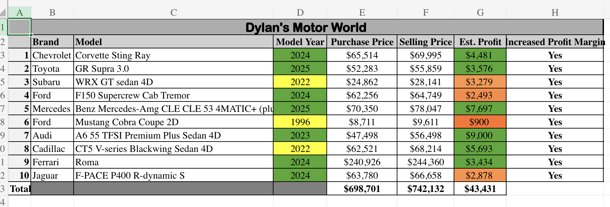
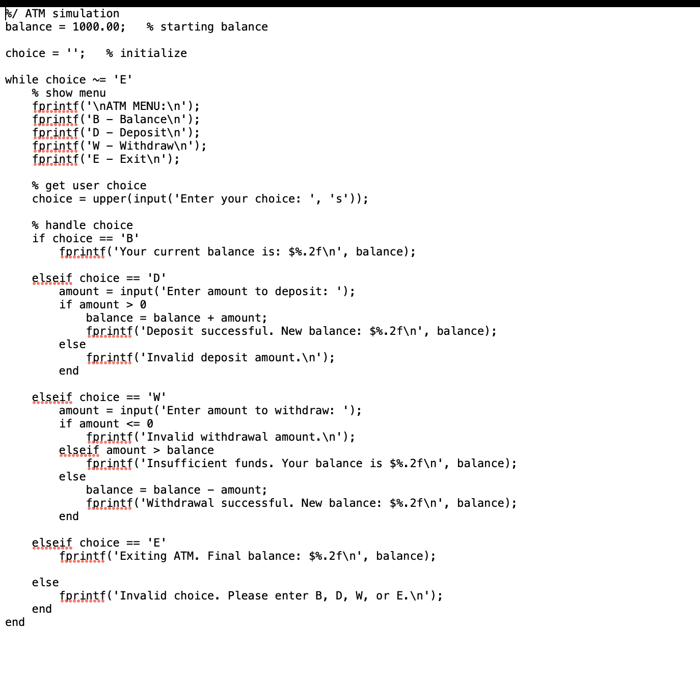

# my-portfolio
A personal portfolio showcasing my work, education, and projects.

# Dylan van der Walt

### About Me
Hi!  I am Dylan van der Walt, a senior at Loyola University Maryland studying in BioHealth with a concentration on Commercialization and minoring in Marketing.  I am fascinated about the merging of healthcare, technology, and business, particularly how innovative medical products can improve patient outcomes.  I'm highly motivated, competitive, and team-oriented, all of which I developed throughout my four years as a Division I men's soccer player at Loyola.  Whether on the field or in a professional setting, I bring a strong work ethic, resilience, and a desire to learn every day. I also, in my free time, like to cook and watch movies

### Education
**BSc in [Bio Health]**  
Loyola University Maryland

### Projects

#### Making a schedule
- 
- Initial project idea
I needed a clearer way to manage my courses and weekly commitments. The goal was to create a visual schedule so assignments, classes, and events were easier to track and plan around.

Tools I used:
Microsoft Outlook calendar, color-coding tools, weekly schedule view, and screenshot capture.

Challenges I faced:
Making the calendar readable took some experimenting with layout and color choices. I also had to ensure every recurring class appeared correctly in the week view.

Other Resources:
Guidance from the assignment instructions and examples provided through Moodle. YouTube

Result:
Then I successfully built a clean, color-coded schedule that keeps my school week organized. If I continued this project, I’d add reminders and integrate personal goals.

Summary:
Organized and color-coded a full school-week Outlook calendar to improve time management, visibility of assignments, and planning throughout the semester.

***
#### Creating a budget tracker
- 
- Initial project idea:
The assignment required recreating a small business inventory system. I wanted to solve how a business could easily track costs, selling prices, and profits in one place for cars.

Tools I used:
Microsoft Excel — multi-sheet organization, formulas, profit calculations, formatting tools, merged cells, embedded comments.

Challenges I faced:
Creating the correct formulas and formatting multiple sheets so they synced properly was a challenge. Every now and then I would get an error. It took trial and error to ensure accurate profit calculations and clear presentation.

Other Resources:
Class materials and examples from the professor were given like vidoes 

Result:
I completed a fully formatted inventory manager spreadsheet that analyzes profit margins and organizes item details professionally. With more time, I’d add conditional formatting and automate updates.

Summary:
Built a multi-sheet Excel inventory system that tracks item prices, calculates profits, and uses structured formatting to simulate small-business financial analysis.
***
#### ATM simulation
- 
- Initial project idea:
I designed this program to simulate essential ATM functions. The goal was to solve how users could interact with a digital banking menu and receive instant updates to their account balance.

Tools I used:
Different MATLAB tools — while loops, user input, formatted text output, and conditional logic (if/elseif).

Challenges I faced:
Debugging input handling and avoiding negative or invalid values was tricky. I had to structure the logic carefully so each menu action worked and updated the balance correctly. Tried to avoid getting a syntax error and messing up the code

Other Resources:
Class coding notes and MATLAB vids.

Result:
The ATM simulation works successfully for deposits, withdrawals, and balance checks. If expanded, I’d add PIN authentication and a transaction history log.

Summary:
Created a functional MATLAB ATM simulation allowing users to check balances, deposit, withdraw, and receive feedback using loops, conditions, and formatted outputs.
