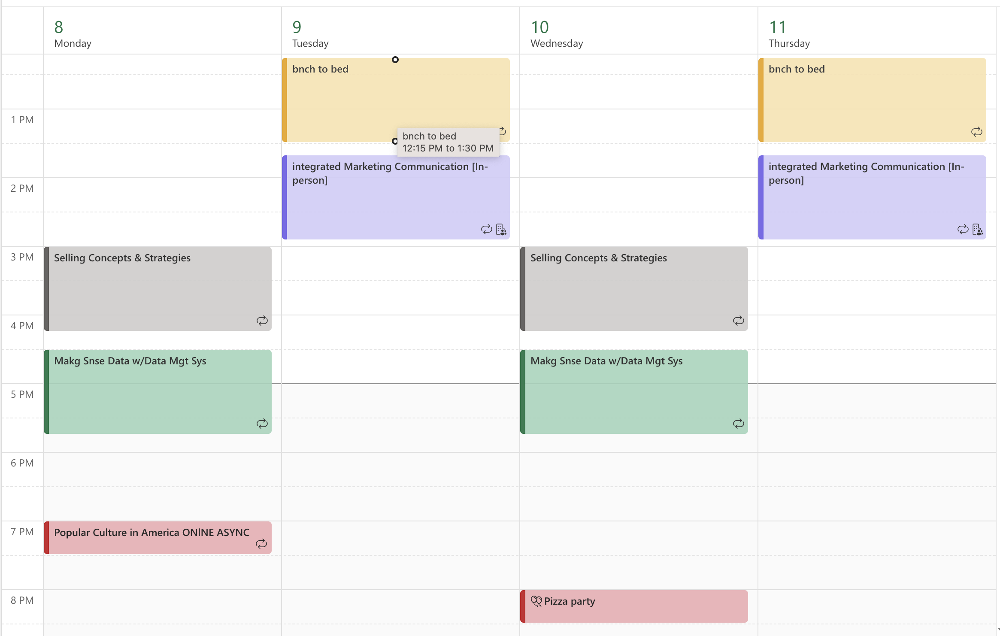

# my-portfolio
A personal portfolio showcasing my work, education, and projects.

# Dylan van der Walt

### About Me
Hi!  I am Dylan van der Walt, a senior at Loyola University Maryland studying in BioHealth with a concentration on Commercialization and minoring in Marketing.  I am fascinated about the merging of healthcare, technology, and business, particularly how innovative medical products can improve patient outcomes.  I'm highly motivated, competitive, and team-oriented, all of which I developed throughout my four years as a Division I men's soccer player at Loyola.  Whether on the field or in a professional setting, I bring a strong work ethic, resilience, and a desire to learn every day.

### Education
**BSc in [Bio Health]**  
Loyola University Maryland

### Projects

#### Project 1 Title
- 
- For this assignment, I created a fully organized Microsoft Outlook weekly calendar to manage my academic schedule. I added all five of my recurring classes, plus additional events, and applied a color-coding system to show differences in course types and priorities.

***
#### Project 2 Title
- 
- Write-up here

***
#### Project 3 Title
- 
- Write-up here
